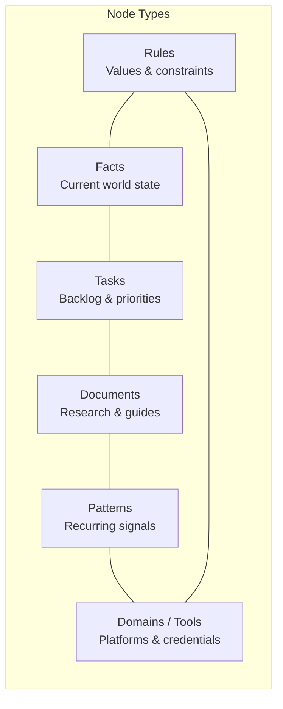

# thecede

**Real-time interactive graph explorer for [Cortex](https://github.com/MikeSquared-Agency/cortex) — the embedded graph memory engine for AI agents.**


---

## What is thecede?

thecede visualises a live [Cortex](https://github.com/MikeSquared-Agency/cortex) knowledge graph as an interactive force-directed network. Cortex is an embedded graph memory engine — agents write nodes and edges during work, and thecede renders the result in real time over SSE.

Watch your agent's memory grow live: nodes appear, edges auto-link, trust scores shift — all streamed straight from Cortex with no polling or page refresh.

---

## Features

- **Force-directed graph** — D3.js v7 physics simulation with smooth animations
- **Live SSE streaming** — nodes and edges appear in real time as the agent writes them
- **Search & filter** — real-time sidebar search with kind filters and node highlighting
- **Graph controls** — zoom, pan, drag, fit-to-view, wobble animation
- **Colour-coded types** — each node kind gets a distinct colour in the legend
- **Node detail panel** — full metadata, body, tags, trust score, connected edges
- **Activity stream** — SSE-powered feed of every mutation as it happens
- **Built-in terminal** — query nodes, search, inspect edges without leaving the browser
- **How It Works** — explainer page describing Cortex concepts and node types
- **WebMCP support** — exposes Cortex tools to in-browser agents via `navigator.modelContext`
- **Responsive** — works on desktop and mobile

---

## Architecture

```
┌─────────────┐     SSE stream      ┌──────────────┐
│   Browser    │◄───────────────────►│    Cortex    │
│  (thecede)   │    REST (proxy)     │   :9091      │
│   :3000      ├────────────────────►│              │
└─────────────┘                      └──────────────┘
       │                                    ▲
       │  Next.js API route                 │
       │  /api/cortex/*  ──────────────────►│
       │  (server-side proxy)
```

- **SSE** connects directly from browser → Cortex for live mutation events
- **REST** goes through the Next.js API proxy to avoid mixed-content / CORS issues
- thecede is a **read-only observer** — it watches the same graph your agent writes to

---

## Quick Start

### Prerequisites

- **Node.js ≥ 18.17** (`node -v`)
- **A running Cortex server** — [install guide](https://github.com/MikeSquared-Agency/cortex#run)

### Install & run

```bash
cd webapp
npm install
npm run dev
# Open http://localhost:3000
```

By default thecede connects to Cortex at `http://localhost:9091`. Override with:

```bash
NEXT_PUBLIC_CORTEX_URL=http://your-cortex-host:9091 npm run dev
```

### Docker

```bash
docker build -t thecede \
  --build-arg NEXT_PUBLIC_CORTEX_URL=http://YOUR_CORTEX_HOST:9091 \
  -f webapp/Dockerfile webapp/

docker run -p 3000:3000 \
  -e CORTEX_BACKEND_URL=http://cortex:9091 \
  thecede
```

---

## How Cortex Works



Every time an agent learns something, makes a decision, or finishes a task, it writes a node to Cortex. Connections between nodes become edges. Cortex auto-links related nodes in the background via similarity rules, decay, and deduplication. Trust is computed from graph topology at query time — never stored as a static field.

---

## Tech Stack

| Layer | Technology | Role |
|---|---|---|
| **Frontend** | Next.js 16, React 19, TypeScript | Webapp framework |
| **Visualization** | D3.js v7, Motion (Framer) | Force graph + animations |
| **UI** | Tailwind CSS 4, shadcn/ui, Radix, Lucide | Component library |
| **State** | Zustand | Client-side graph state |
| **Backend** | [Cortex](https://github.com/MikeSquared-Agency/cortex) | Embedded graph memory engine (Rust, redb, gRPC + HTTP) |

---

## Project Structure

```
thecede/
├── webapp/                        # Next.js graph explorer
│   ├── src/
│   │   ├── app/(cortex)/          # Route group: graph page, about, how-it-works
│   │   ├── app/api/cortex/        # API proxy to Cortex backend
│   │   ├── components/
│   │   │   ├── graph/             # GraphView, Canvas, Controls, Legend, Sidebar, LiveChat
│   │   │   ├── how-it-works/      # Hero, ChapterSection, NodeTypeCard
│   │   │   ├── layout/            # CortexHeader
│   │   │   ├── terminal/          # Terminal component
│   │   │   └── ui/                # shadcn primitives
│   │   └── lib/
│   │       ├── cortex-client.ts   # Typed HTTP client for Cortex API
│   │       ├── data/              # Embedded fallback graph data
│   │       ├── stores/            # Zustand graph store
│   │       └── types/             # TypeScript interfaces
│   └── package.json
├── analyze-cortex.py              # Cortex export analysis utility
└── README.md
```

---

## Related

| Repo | Description |
|---|---|
| [**cortex**](https://github.com/MikeSquared-Agency/cortex) | Embedded graph memory engine for AI agents |
| [**thecede**](https://github.com/MikeSquared-Agency/thecede) | Real-time graph explorer (this repo) |

---

## License

MIT
