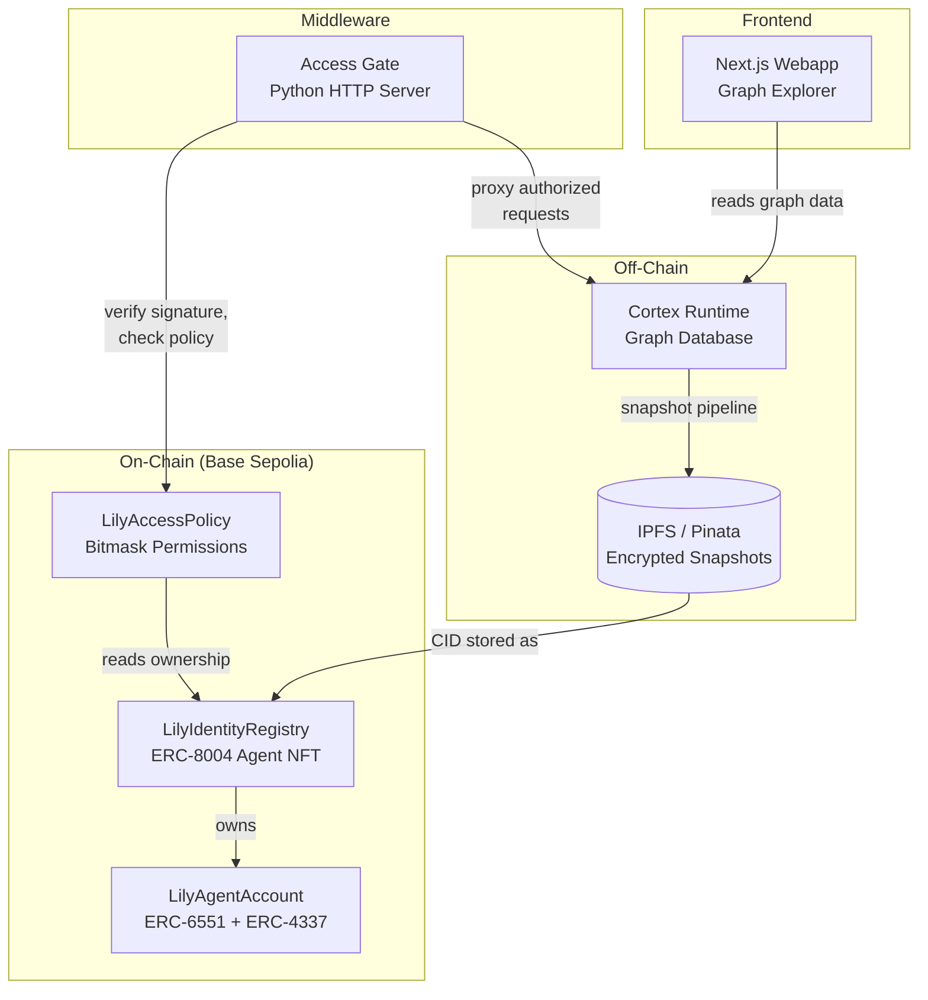
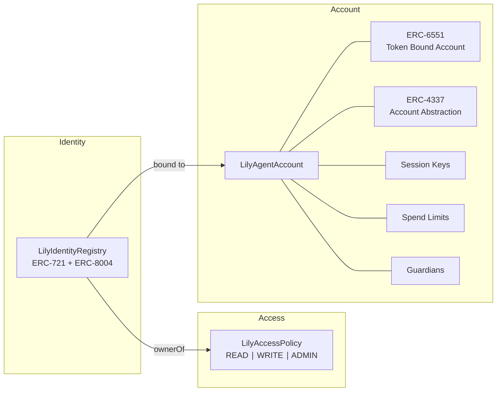
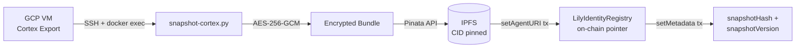
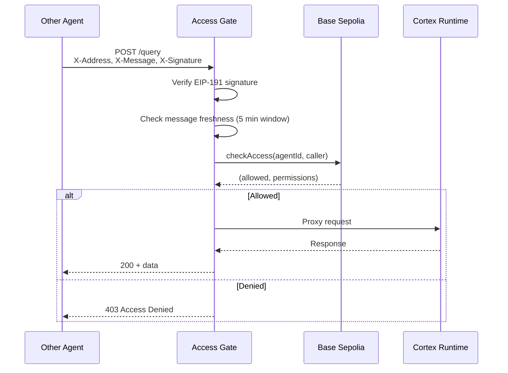

# Lily Graph

**Interactive knowledge graph explorer + on-chain identity stack for an autonomous AI agent.**

Built by **Team CortexClaw** for the UK AI Agent Hackathon EP4.


---

## Overview

Lily is an autonomous AI agent that maintains a persistent knowledge graph called **Cortex** — 834 nodes and 30,000+ edges representing her rules, facts, documents, tasks, patterns, and tools. This repository contains:

1. **Webapp** — a Next.js graph explorer that renders Lily's Cortex memory live with D3.js force simulation, search, filtering, and a "How It Works" storytelling page.
2. **Smart Contracts** — an ERC-8004 identity registry, access policy, and ERC-6551/4337 agent account deployed to Base Sepolia.
3. **Access Gate** — HTTP middleware that verifies EIP-191 signatures and checks on-chain permissions before proxying requests to the Cortex runtime.
4. **Snapshot Pipeline** — exports Cortex state, encrypts with AES-256-GCM, pins to IPFS via Pinata, and updates the on-chain context pointer.

---

## Architecture



---

## Smart Contract Architecture



| Contract | Standard | Purpose |
|---|---|---|
| `LilyIdentityRegistry` | ERC-8004 / ERC-721 | Agent NFT with context pointer (IPFS CID), on-chain metadata, and wallet bindings |
| `LilyAccessPolicy` | — | Bitmask access control (READ=1, WRITE=2, ADMIN=4) with expiry, tied to agent NFT ownership |
| `LilyAgentAccount` | ERC-6551 / ERC-4337 | Token Bound Account with session keys, daily spend limits, and guardian multi-approval |

---

## Data Pipeline



The `scripts/snapshot-cortex.py` pipeline:
1. SSH into the GCP VM and export Cortex state as JSON
2. Encrypt with AES-256-GCM (12-byte nonce + ciphertext)
3. Pin the encrypted bundle to IPFS via Pinata
4. Update the on-chain agent URI (`ipfs://<CID>`) and metadata (content hash, version)

---

## Access Flow



---

## Features

- **Force-directed graph** — D3.js v7 physics simulation rendering 300 nodes with real edges
- **Search & filter** — real-time sidebar search with node highlighting
- **Graph controls** — zoom, pan, drag nodes, fit-to-view, node wobble animation
- **Colour-coded types** — Rules, Facts, Documents, Tasks, Patterns, Domains/Tools
- **"How It Works"** — narrative storytelling page explaining Cortex from Lily's perspective
- **Terminal** — embedded terminal component at the bottom of the layout
- **Live chat** — floating Twitch-style chat stream overlay on the graph
- **Responsive** — works on desktop and mobile

---

## Tech Stack

| Layer | Technology | Role |
|---|---|---|
| **Frontend** | Next.js 16, React 19, TypeScript | Webapp framework |
| **Visualization** | D3.js v7, Motion (Framer) | Force graph + animations |
| **UI** | Tailwind CSS 4, shadcn/ui, Radix, Lucide | Component library |
| **State** | Zustand | Client-side graph state |
| **Contracts** | Solidity 0.8.24, Foundry, OpenZeppelin | On-chain identity + access |
| **Chain** | Base Sepolia (EVM) | Testnet deployment |
| **Middleware** | Python 3.12, web3.py, eth-account | Access Gate server |
| **IPFS** | Pinata | Encrypted snapshot storage |
| **Graph Builder** | Python 3 | Static HTML export (D3.js) |
| **Hosting** | Surge | Static site (legacy explorer) |

---

## Project Structure

```
lily-graph/
├── webapp/                        # Next.js graph explorer
│   ├── src/
│   │   ├── app/(cortex)/          # Route group: graph page + how-it-works
│   │   ├── components/
│   │   │   ├── graph/             # GraphView, Canvas, Controls, Legend, Sidebar, LiveChat
│   │   │   ├── how-it-works/      # Hero, ChapterSection, NodeTypeCard
│   │   │   ├── layout/            # CortexHeader
│   │   │   ├── terminal/          # Terminal component
│   │   │   └── ui/                # shadcn primitives
│   │   └── lib/
│   │       ├── data/              # Cortex graph data
│   │       ├── stores/            # Zustand graph store
│   │       └── types/             # TypeScript interfaces
│   └── package.json
├── contracts/                     # Foundry project (Solidity)
│   ├── src/
│   │   ├── LilyIdentityRegistry.sol    # ERC-8004 agent NFT
│   │   ├── LilyAccessPolicy.sol        # On-chain access control
│   │   ├── LilyAgentAccount.sol        # ERC-6551 + ERC-4337 account
│   │   └── interfaces/                 # IERC8004, IERC6551, ILilyAccessPolicy
│   ├── script/Deploy.s.sol             # Full deployment script
│   ├── test/Lily.t.sol                 # Forge tests
│   └── foundry.toml
├── access-gate/                   # HTTP middleware
│   ├── server.py                  # Access Gate server
│   ├── requirements.txt           # web3, eth-account, cryptography
│   └── Dockerfile
├── scripts/
│   └── snapshot-cortex.py         # IPFS snapshot pipeline
├── build-lily-graph.py            # Static D3.js graph builder
├── lily-cortex-fixed.html         # Built static explorer
└── README.md
```

---

## Getting Started

### Webapp

```bash
cd webapp
npm install
npm run dev
# Open http://localhost:3000
```

### Smart Contracts

Requires [Foundry](https://book.getfoundry.sh/getting-started/installation).

```bash
cd contracts
forge install
forge build
forge test

# Deploy to Base Sepolia
forge script script/Deploy.s.sol:DeployLily \
  --rpc-url $BASE_SEPOLIA_RPC_URL \
  --private-key $PRIVATE_KEY \
  --broadcast
```

### Access Gate

```bash
cd access-gate
pip install -r requirements.txt

# Configure environment
export BASE_SEPOLIA_RPC_URL="..."
export POLICY_ADDRESS="..."
export REGISTRY_ADDRESS="..."
export CORTEX_URL="http://localhost:9091"

python server.py
# Listening on http://0.0.0.0:8888
```

Or with Docker:

```bash
cd access-gate
docker build -t lily-access-gate .
docker run -p 8888:8888 \
  -e BASE_SEPOLIA_RPC_URL="..." \
  -e POLICY_ADDRESS="..." \
  lily-access-gate
```

### Graph Builder (Legacy Static)

```bash
# Requires cortex-fresh-export.json in the root directory
python build-lily-graph.py
# Outputs: lily-cortex-fixed.html
```

---

## Related Repositories

| Repo | Description |
|---|---|
| **Xbot** | Lily's X (Twitter) automation agent — outreach, engagement, content scheduling |
| **Cortex** | The graph database runtime that stores Lily's persistent memory (nodes + edges) |

---

## Team CortexClaw

Built for the **UK AI Agent Hackathon EP4**.

---

## License

MIT
