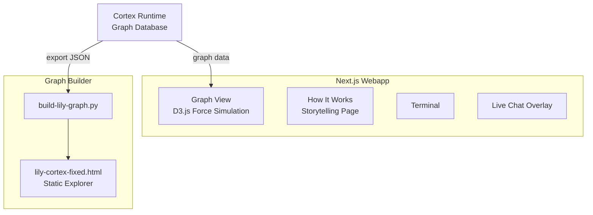
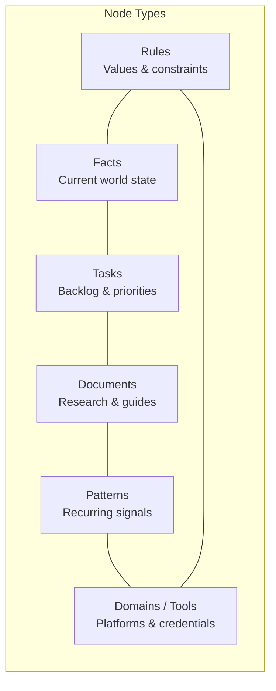

# Lily Graph

**Interactive knowledge graph explorer for an autonomous AI agent.**

Built by **Team CortexClaw** for the UK AI Agent Hackathon EP4.


---

## Overview

Lily is an autonomous AI agent that maintains a persistent knowledge graph called **Cortex** — 834 nodes and 30,000+ edges representing her rules, facts, documents, tasks, patterns, and tools. This repository contains:

1. **Webapp** — a Next.js graph explorer that renders Lily's Cortex memory live with D3.js force simulation, search, filtering, and a "How It Works" storytelling page.
2. **Graph Builder** — a Python script that exports Cortex data into a self-contained static HTML explorer.

---

## Architecture



---

## Features

- **Force-directed graph** — D3.js v7 physics simulation rendering 300 nodes with real edges
- **Search & filter** — real-time sidebar search with node highlighting
- **Graph controls** — zoom, pan, drag nodes, fit-to-view, node wobble animation
- **Colour-coded types** — Rules, Facts, Documents, Tasks, Patterns, Domains/Tools
- **"How It Works"** — narrative storytelling page explaining Cortex from Lily's perspective
- **Terminal** — embedded terminal component at the bottom of the layout
- **Live chat** — floating Twitch-style chat stream overlay on the graph
- **Responsive** — works on desktop and mobile

---

## How Cortex Works



Every time Lily learns something, makes a decision, or finishes a task, she writes a node to Cortex. Connections between nodes become edges. When a new session starts, she searches Cortex to rebuild context in ~30 seconds and picks up where she left off.

The graph explorer renders the top 300 nodes by importance score (0–1) with their real edges from the full 834-node graph.

---

## Tech Stack

| Layer | Technology | Role |
|---|---|---|
| **Framework** | Next.js 16, React 19, TypeScript | Webapp |
| **Visualization** | D3.js v7, Motion (Framer) | Force graph + animations |
| **UI** | Tailwind CSS 4, shadcn/ui, Radix, Lucide | Component library |
| **State** | Zustand | Client-side graph state |
| **Graph Builder** | Python 3 | Static HTML export (D3.js) |
| **Hosting** | Surge | Static site (legacy explorer) |

---

## Project Structure

```
lily-graph/
├── webapp/                        # Next.js graph explorer
│   ├── src/
│   │   ├── app/(cortex)/          # Route group: graph page + how-it-works
│   │   ├── components/
│   │   │   ├── graph/             # GraphView, Canvas, Controls, Legend, Sidebar, LiveChat
│   │   │   ├── how-it-works/      # Hero, ChapterSection, NodeTypeCard
│   │   │   ├── layout/            # CortexHeader
│   │   │   ├── terminal/          # Terminal component
│   │   │   └── ui/                # shadcn primitives
│   │   └── lib/
│   │       ├── data/              # Cortex graph data
│   │       ├── stores/            # Zustand graph store
│   │       └── types/             # TypeScript interfaces
│   └── package.json
├── build-lily-graph.py            # Static D3.js graph builder
├── lily-cortex-fixed.html         # Built static explorer
├── analyze-cortex.py              # Cortex data analysis utility
├── cortex-live-server.py          # SSE server for live graph updates
└── README.md
```

---

## Getting Started

### Webapp

```bash
cd webapp
npm install
npm run dev
# Open http://localhost:3000
```

### Graph Builder (Static)

```bash
# Requires cortex-fresh-export.json in the root directory
python build-lily-graph.py
# Outputs: lily-cortex-fixed.html
```

---

## Related Repositories

| Repo | Description |
|---|---|
| **Xbot** | Lily's X (Twitter) automation agent — outreach, engagement, content scheduling |
| **Cortex** | The graph database runtime that stores Lily's persistent memory (nodes + edges) |

---

## Team CortexClaw

Built for the **UK AI Agent Hackathon EP4**.

---

## License

MIT
