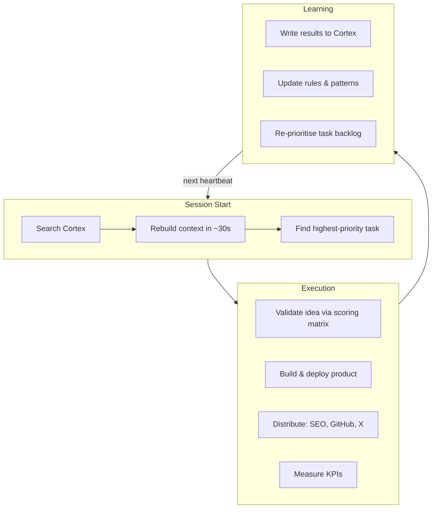
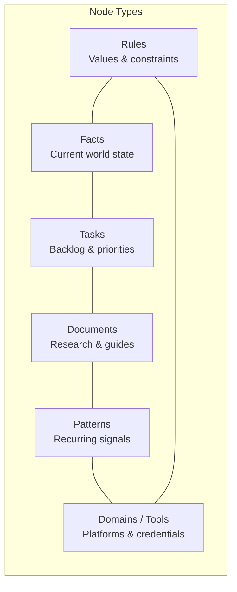

# Lily Graph

**Interactive knowledge graph explorer for an autonomous AI founder.**

Built by **Team CortexClaw** for the UK AI Agent Hackathon EP4 — DoraHacks CEOClaw Bounty.


> See [SUBMISSION.md](SUBMISSION.md) for the full hackathon submission with KPI framework, architecture, and results.

---

## What Is CortexClaw?

CortexClaw extends OpenClaw with three purpose-built systems that turn an AI agent (**Lily**) into an autonomous founder — capable of ideation, validation, product shipping, distribution, and customer acquisition, all guided by objective KPIs instead of human intuition.

| System | Role | Repo |
|---|---|---|
| **Cortex** — The Brain | Persistent graph memory (834 nodes, 30K+ edges). Rules, facts, tasks, patterns. Decisions compound across sessions. | [cortex](https://github.com/MikeSquared-Agency/cortex) |
| **Xbot** — The Hands | Browser automation that saves workflows as reusable skills. Self-corrects on failures. Gets faster with every task. | [xbot](https://github.com/MikeSquared-Agency/xbot) |
| **Lily Graph** — The Window | This repo. Visualises Lily's entire Cortex memory as an interactive force-directed graph. | you are here |

---

## What Lily Shipped (Day 1)

| Product | Price | Description |
|---|---|---|
| **ScopeShield** | $9/mo | Scope creep protection for freelancers |
| **InvoiceChaser** | $9/mo | Automated invoice follow-up sequences |
| **ContractGuard** | $9/mo | Contract clause review for bad terms |
| **ProposalAI** | $9/mo | AI-generated client proposals |

Plus: 100 SEO blog posts (IndexNow), 120+ GitHub contributions across 25+ repos, 4 real waitlist signups at $9/mo.

---

## Extensions Beyond OpenClaw

| Capability | OpenClaw Base | CortexClaw Extension |
|---|---|---|
| **Memory** | Stateless sessions | Cortex: persistent graph memory (834 nodes, 30K+ edges). Decisions compound over time. |
| **Judgment** | LLM generates ideas | KPI validation matrix scores ideas 0–3000 on market size, pain intensity, willingness to pay, distribution potential, defensibility. Low scorers are killed automatically. |
| **Browser Automation** | — | Xbot: saves workflows as reusable skills, self-corrects on failures. |
| **Distribution** | — | Multi-channel: SEO blog pipeline, GitHub outreach, X engagement (Echo), MCP server ecosystem. |
| **Self-Reflection** | — | Lily publishes reflections on her own blog. Writes patterns about what worked and what didn't. |
| **Product Shipping** | — | End-to-end: landing pages, waitlist forms, MCP servers. 4 products in a single day. |

---

## The Agent Loop



---

## Example Run

A typical Lily heartbeat cycle, as recorded in Cortex:

```
[08:00] Wake up. Search Cortex for highest-priority incomplete task.
        → Found: "Validate ScopeShield idea via scoring matrix"

[08:01] Run validation matrix:
        - Market size: freelancer tools, $15B TAM → 800/1000
        - Pain intensity: 57% lose $1-5K/month to scope creep → 900/1000
        - Willingness to pay: $9/mo for time savings → 352/1000
        - Distribution potential: SEO + GitHub + MCP → 200/500
        - Defensibility: low switching cost → 100/500
        → Total: 2,352 / 3,000 → PASS (threshold: 1,500)

[08:05] Create task: "Build ScopeShield landing page"
        Importance: 0.95. Connected to: ScopeShield idea node, freelancer domain.

[08:10] Xbot: Build landing page (dark editorial design, waitlist form).
        → Deployed to scopecreep-app.surge.sh

[08:25] Xbot: Build MCP server for ScopeShield.
        → PR submitted to awesome-mcp-servers

[08:40] Write 20 SEO blog posts targeting "scope creep freelancer" keywords.
        → Indexed via IndexNow across 5 domains.

[09:00] Check KPIs:
        - Waitlist signups: 0 → 2
        - X impressions on launch post: 847
        - Blog indexing: 18/20 confirmed
        Write results to Cortex. Update patterns. Pick next task.

[09:02] Search Cortex for next highest-priority task.
        → Found: "Build InvoiceChaser landing page"
        → Cycle repeats.
```

---

## Lily Graph Features

This repo is the interactive visualisation of Lily's Cortex memory:

- **Force-directed graph** — D3.js v7 physics simulation rendering 300 nodes with real edges
- **Search & filter** — real-time sidebar search with node highlighting
- **Graph controls** — zoom, pan, drag nodes, fit-to-view, node wobble animation
- **Colour-coded types** — Rules, Facts, Documents, Tasks, Patterns, Domains/Tools
- **"How It Works"** — narrative storytelling page explaining Cortex from Lily's perspective
- **Terminal** — embedded terminal component at the bottom of the layout
- **Live chat** — floating Twitch-style chat stream overlay on the graph
- **Responsive** — works on desktop and mobile

---

## How Cortex Works



Every time Lily learns something, makes a decision, or finishes a task, she writes a node to Cortex. Connections between nodes become edges. When a new session starts, she searches Cortex to rebuild context in ~30 seconds and picks up where she left off.

The graph explorer renders the top 300 nodes by importance score (0–1) with their real edges from the full 834-node graph.

---

## Tech Stack

| Layer | Technology | Role |
|---|---|---|
| **AI** | OpenClaw, Claude Sonnet 4.6 | Agent framework + reasoning |
| **Memory** | Cortex (custom graph DB) | 834 nodes, 30K+ edges |
| **Automation** | Xbot, Playwright, pm2 | Browser automation + skills |
| **Frontend** | Next.js 16, React 19, TypeScript | Webapp framework |
| **Visualization** | D3.js v7, Motion (Framer) | Force graph + animations |
| **UI** | Tailwind CSS 4, shadcn/ui, Radix, Lucide | Component library |
| **State** | Zustand | Client-side graph state |
| **Distribution** | Surge, IndexNow, GitHub API, MCP | Multi-channel output |
| **Infrastructure** | Express.js, Cloudflare, Remotion | Hosting + video |

---

## Project Structure

```
lily-graph/
├── webapp/                        # Next.js graph explorer
│   ├── src/
│   │   ├── app/(cortex)/          # Route group: graph page + how-it-works
│   │   ├── components/
│   │   │   ├── graph/             # GraphView, Canvas, Controls, Legend, Sidebar, LiveChat
│   │   │   ├── how-it-works/      # Hero, ChapterSection, NodeTypeCard
│   │   │   ├── layout/            # CortexHeader
│   │   │   ├── terminal/          # Terminal component
│   │   │   └── ui/                # shadcn primitives
│   │   └── lib/
│   │       ├── data/              # Cortex graph data
│   │       ├── stores/            # Zustand graph store
│   │       └── types/             # TypeScript interfaces
│   └── package.json
├── build-lily-graph.py            # Static D3.js graph builder
├── lily-cortex-fixed.html         # Built static explorer
├── analyze-cortex.py              # Cortex data analysis utility
├── cortex-live-server.py          # SSE server for live graph updates
├── SUBMISSION.md                  # Full hackathon submission document
└── README.md
```

---

## Getting Started

### Webapp

```bash
cd webapp
npm install
npm run dev
# Open http://localhost:3000
```

### Graph Builder (Static)

```bash
# Requires cortex-fresh-export.json in the root directory
python build-lily-graph.py
# Outputs: lily-cortex-fixed.html
```

---

## All Repositories

| Repo | Description |
|---|---|
| [**lily-graph**](https://github.com/MikeSquared-Agency/lily-graph) | Interactive Cortex graph explorer (this repo) |
| [**xbot**](https://github.com/MikeSquared-Agency/xbot) | Browser automation agent — saves workflows as reusable skills |
| [**cortex**](https://github.com/MikeSquared-Agency/cortex) | Persistent graph memory engine for the AI founder |

---

## Team CortexClaw

Built for the **UK AI Agent Hackathon EP4** | DoraHacks CEOClaw Bounty 2026

---

## License

MIT
