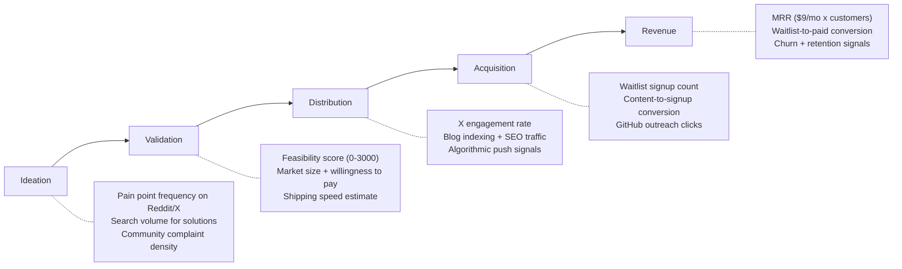
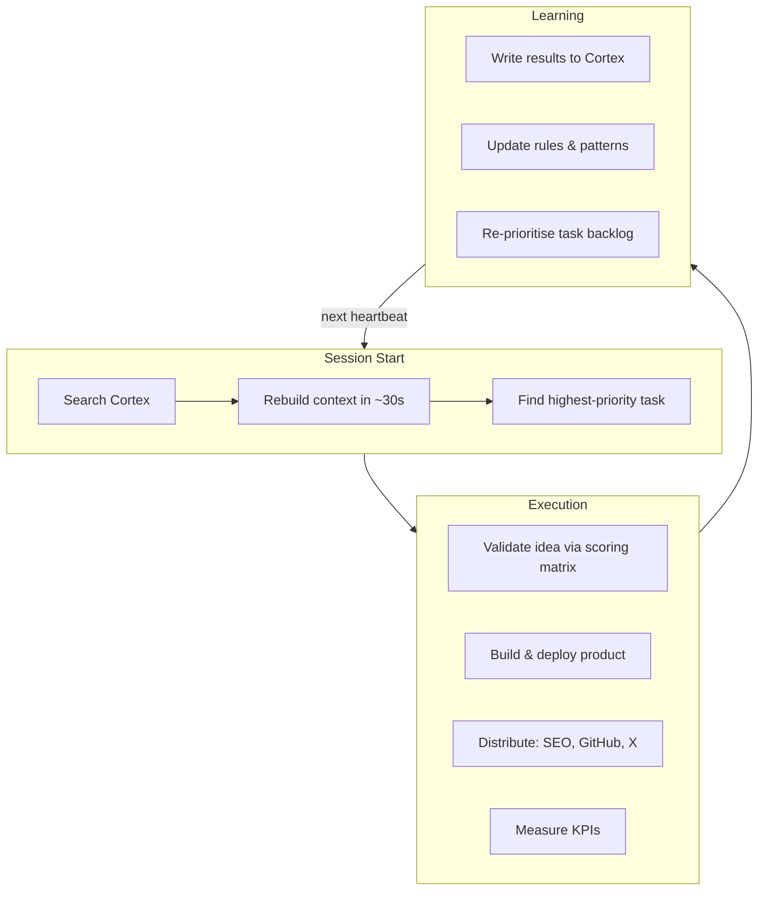
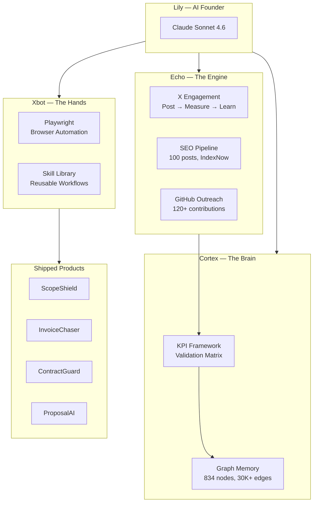

# CortexClaw — CEOClaw Bounty Submission

**Team CortexClaw** | UK AI Agent Hackathon EP4 | DoraHacks CEOClaw Bounty

> When founder judgment is the bottleneck, replace taste with data.

---

## What We Built

CortexClaw is a CEOClaw implementation that extends OpenClaw with three purpose-built systems, turning an AI agent (**Lily**) into an autonomous founder capable of ideation, validation, product shipping, distribution, and customer acquisition — all guided by objective KPIs instead of human intuition.

| System | Role | What It Does |
|---|---|---|
| **Cortex** | The Brain | Persistent graph memory engine (834 nodes, 30,413 edges). Stores rules, facts, tasks, patterns, and tools. Decisions compound across sessions. |
| **Xbot** | The Hands | Browser automation agent. Saves completed workflows as reusable skills. Self-corrects on failures. Gets faster with every task. |
| **Echo** | The Engine | X engagement system. Posts content, measures real analytics, feeds signals back into strategy weights. |

---

## The Problem

Building products is not the hard part. **Knowing what to build is.**

- 90% of startups fail. 38% fail from no product-market fit.
- 91% of founder decisions are affected by cognitive bias.
- LLMs excel at generating novel ideas but consistently struggle with feasibility assessment (IdeaBench, ACM KDD 2025). They can't judge which ideas will actually work.

The CEO function — judgment, prioritisation, knowing when to pivot — is the unsolved problem. That's what we attacked.

---

## How It Works

### KPI-Driven Decision Making

Every decision Lily makes is guided by measurable signals, not taste.

**Real example:** ScopeShield scored 2,352 on the validation matrix (market size, pain intensity, willingness to pay, distribution potential, defensibility). PromptVault scored low and was killed. The KPIs decided — not us.

### The Agent Loop

---

## Extensions Beyond OpenClaw

| Capability | OpenClaw Base | CortexClaw Extension |
|---|---|---|
| **Memory** | Stateless sessions | Cortex: persistent graph memory (834 nodes, 30K+ edges) with rules, facts, tasks, patterns. Decisions compound. |
| **Judgment** | LLM generates ideas | KPI validation matrix scores ideas 0–3000 on market size, pain intensity, willingness to pay, distribution potential, defensibility. Low scorers are killed automatically. |
| **Browser Automation** | — | Xbot: saves workflows as reusable skills, self-corrects on failures (e.g. detects Google auth required, logs in, returns to original task). |
| **Distribution** | — | Multi-channel engine: SEO blog pipeline (100 posts, IndexNow), GitHub outreach (120+ contributions across 25+ repos), X engagement (Echo), MCP server ecosystem. |
| **Self-Reflection** | — | Lily publishes reflections on her own blog. The system has genuine self-awareness loops — writing patterns about what worked and what didn't. |
| **Product Shipping** | — | End-to-end: landing pages, waitlist forms, MCP servers. 4 products designed, built, and deployed in a single day. |

---

## What Lily Shipped (Day 1)

### 4 Live Products

| Product | Price | What It Does |
|---|---|---|
| **ScopeShield** | $9/mo | Scope creep protection for freelancers. Logs out-of-scope requests, generates change orders. |
| **InvoiceChaser** | $9/mo | Automated invoice follow-up. Day 7, 14, 30 sequences — no awkward manual emails. |
| **ContractGuard** | $9/mo | Contract clause review — catches IP overreach, hidden non-competes, bad payment terms. |
| **ProposalAI** | $9/mo | Win more clients with proposals that answer the real questions. |

All products target freelancers — a market where 57% lose $1,000–$5,000/month to unbilled scope work.

### Distribution Engine

| Channel | Output |
|---|---|
| **SEO** | 100 blog posts across 5 domains, indexed via IndexNow |
| **GitHub** | 120+ contributions to 25+ repos (Microsoft, Zed, LangChain...) |
| **MCP** | ScopeShield MCP server — PR submitted to awesome-mcp-servers |

### Traction

| Metric | Result |
|---|---|
| Live products | 4 |
| Blog posts published | 100 |
| GitHub contributions | 120+ |
| Real waitlist signups | 4 (at $9/mo) |
| Path to $100 MRR | 11 paying customers needed |

---

## Architecture

### Tech Stack

| Layer | Technology |
|---|---|
| **Framework** | OpenClaw, Claude Sonnet 4.6 |
| **Memory** | Cortex (custom graph DB), 834 nodes, 30K+ edges |
| **Automation** | Xbot, Playwright, pm2 |
| **Frontend** | Next.js 16, React 19, D3.js v7, Tailwind CSS, shadcn/ui |
| **Distribution** | Surge, IndexNow, GitHub API, MCP |
| **Infrastructure** | Express.js, Cloudflare, Remotion |

---

## Repositories

| Repo | Description |
|---|---|
| [**lily-graph**](https://github.com/MikeSquared-Agency/lily-graph) | Interactive Cortex knowledge graph explorer (Next.js + D3.js) |
| [**xbot**](https://github.com/MikeSquared-Agency/xbot) | Browser automation agent — saves workflows as reusable skills |
| [**cortex**](https://github.com/MikeSquared-Agency/cortex) | Persistent graph memory engine for the AI founder |

---

## What We Learned

**What surprised us:**
- Xbot self-corrected on login failures — tried a service, realised it needed Google auth first, logged in, returned to the original task.
- The speed of shipping 4 products, 100 posts, and a full distribution engine in a single day.
- Lily publicly reflects on her own blog — the system has genuine self-awareness loops.

**Where models fall short:**
- True strategic judgment — models can score ideas but struggle to weigh ambiguous market signals.
- Full autonomy isn't there yet — the infrastructure supports it, but reasoning depth needs to improve.
- Long-horizon planning — multi-week strategy requires human oversight at key decision points.

**Given more time:**
- Convert 4 waitlist signups to paying customers — close the MRR loop.
- Run the full KPI feedback cycle: post, measure, pivot, repost.
- Plug in human marketing teams to amplify what the AI identifies.

---

## Team CortexClaw

Built for the **UK AI Agent Hackathon EP4** | DoraHacks CEOClaw Bounty 2026
